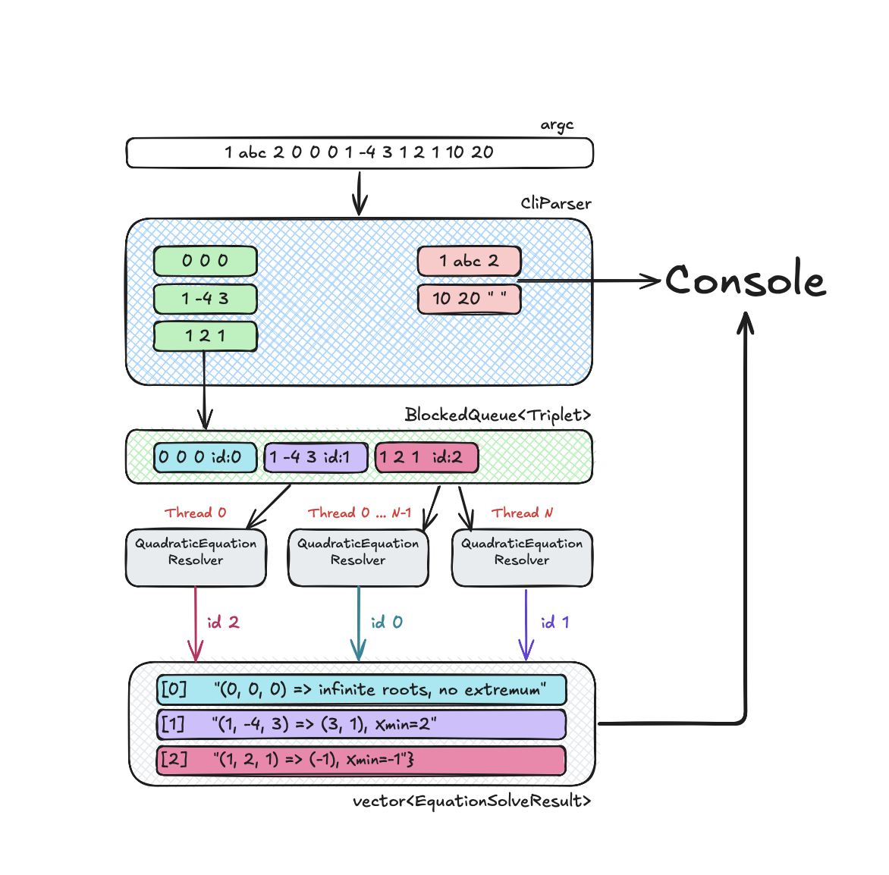

## Table of contents

* [General info](#general-info)
* [Tested](#tested)
* [Under the hood architecture](#under-the-hood-architecture)
* [System requirements](#system-requirements)
* [Setup and Launch](#setup-and-launch)
* [Contacts](#contacts)

## General info

This project is designed to solve quadratic equations provided via command-line arguments.
The program parses sequences of numeric parameters and interprets every three consecutive values (Triplets) as
coefficients (a, b, c)
of a quadratic equation.
The application determines real roots (if any), computes the extremum point (Xmin) of the parabola,
and prints a structured solution for each equation.

## Tested

* MacOs Sequoia 15.3.1
* Ubuntu 22.04

## Under the hood architecture



1️⃣ Cli parsing (CliParser)

The application receives input parameters via argv, where each set of three numeric values is treated
as a potential quadratic equation

Valid triplets (e.g., 0 0 0, 1 -4 3, 1 2 1) are extracted and packed into structured Triplet objects.
Invalid triplets (e.g., 1 abc 2) are skipped and reported to the console with a clear error message.
Each valid Triplet is assigned a unique id which preserves its original order.

2️⃣ Queueing (BlockingQueue)

Validated Triplet objects are pushed into a concurrent queue shared among resolver threads.
The queue serves as the data channel between the parser (producer) and solver (consumers),
supporting multithreaded access.

3️⃣ Solving (QuadraticEquationResolver)

A pool of resolver threads pulls Triplet objects from the queue in parallel.
Each resolver performs the following steps:

Computes the real roots (if any).
Calculates the extremum (Xmin) of the quadratic function.
Formats the result as a readable string.
The result is stored in a shared EquationSolveResult vector, indexed by triplet.id, ensuring correct output order.

4️⃣ Output

After all equations are processed, results are printed in the same order they were received.

## System requirements

* Git
* Cmake version 3.31.0
* C++ 17
* Python 3.12
* Optional : gtest 1.16.0

## Setup and Launch

### 1) Standalone application

``` bash
# 1) clone repo
https://github.com/AlexScherba16/tektask

# 2) go to repo directory
cd tektask

# 3) configure build
cmake -E make_directory build

# build with tests use 
# cmake -B build -DCMAKE_BUILD_TYPE={Debug,Release} -DBUILD_TESTS=ON

# or just default build
cmake -B build

# 4) build application
cmake --build build --parallel 4

# 5) run application
./build/se_solver 1 -2 -3

# Optional, run tests
#./build/test/se_solver_test
```

### 2) e2e tests

``` bash
# 1) clone repo
https://github.com/AlexScherba16/tektask

# 2) go to repo directory
cd tektask

# 3) run e2e tests
python3.12 e2e_runner.py
```

## Contacts

``` 
email:      alexscherba16@gmail.com
telegram:   @Alex_Scherba
```
